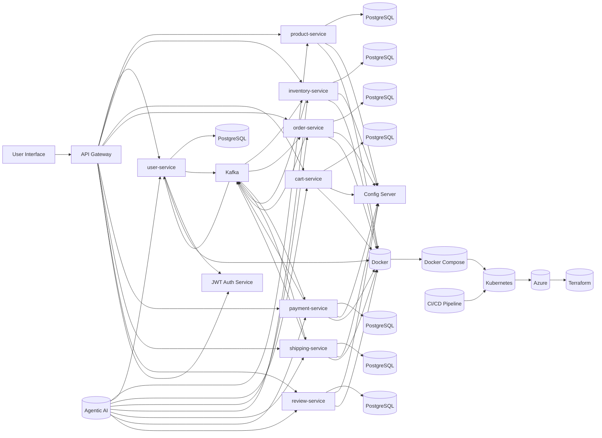

# 👋 Hi, I'm Venkata Sudheer Kumar Kondeti — aka `@devsocket`

Welcome to my GitHub profile! I'm a **Software Architect & DevOps Enthusiast** focused on building **scalable, cloud-native systems** using:

- 🧠 **Java**, **Spring Boot**, **Kafka**, **JWT**
- 🐳 **Docker**, **Kubernetes**, **Helm**
- ☁️ **Terraform**, **Azure**, **CI/CD pipelines**
- 🤖 Agentic AI (coming soon)

I specialize in designing resilient backend platforms, automating infrastructure with IaC, and deploying secure APIs in distributed environments.

---

## 🚀 Featured Project: `ecommerce (springboot-ecommerce-microservices)`

🔗 [View Repository](https://github.com/devsocket/ecommerce)

A production-grade eCommerce backend built with(🚧 In Development):
- **Spring Boot** for RESTful services
- **Kafka** for asynchronous messaging
- **PostgreSQL** for data persistence
- **JWT** for secure authentication
- **Docker & Kubernetes** for container orchestration
- **Terraform & Helm** for Infrastructure as Code

### 🛠️ E-Commerce Microservices Architecture

### 🗺️ Roadmap Highlights
1. Transition to full **Kubernetes** orchestration
2. Set up **CI/CD pipelines** using GitHub Actions or Azure DevOps
3. Provision infrastructure with **Terraform** on Azure
4. Deploy entire solution to the cloud
5. Integrate **Agentic AI** for intelligent automation

> This project reflects my hands-on expertise in backend engineering, DevOps, and cloud-native architecture. It’s actively evolving and serves as a showcase for real-world delivery.

---

## 📚 More Projects Coming Soon

I'm actively working on new repositories that explore:
- 🔐 Advanced security patterns with OAuth2 and Keycloak
- 🧠 AI-powered microservices with LangChain and Agentic frameworks
- ☁️ Multi-cloud deployments with Terraform and Pulumi
- 📦 Event-driven architectures with Kafka Streams and Apache Flink

Stay tuned—these projects will be added and pinned here as they go live.

---

## 🧰 Tech Stack & Tools

**Languages & Frameworks**  
`Java` · `Spring Boot` · `Kafka` · `PostgreSQL`

**DevOps & Cloud**  
`Docker` · `Kubernetes` · `Terraform` · `Helm` · `GitHub Actions` · `Azure DevOps`

**Security & Architecture**  
`JWT` · `OAuth2` · `Microservices` · `REST APIs` · `IaC` · `Agentic AI`

---

## 📈 GitHub Stats

---

## 🌐 Connect & Collaborate

I'm open to:
- 🤝 Freelance or contract opportunities
- 🧠 Technical consulting on cloud-native architecture
- 🛠️ Collaborations on open-source and AI integrations

📫 Reach me via:
- [LinkedIn](https://linkedin.com/in/sudheer44)

---

## 🔍 SEO Keywords for Discoverability

**GitHub Username**: `@devsocket`  
**Name**: Venkata Sudheer Kumar Kondeti  
**Tech Stack**: Java, Spring Boot, Kafka, JWT, Docker, Kubernetes, Terraform, Azure, CI/CD, Helm, PostgreSQL  
**Projects**: ecommerce (springboot-ecommerce-microservices), cloud-native backend, microservices architecture  
**Topics**: Agentic AI, Infrastructure as Code, GitHub Actions, Azure DevOps, scalable systems, backend engineering

---

_This profile is optimized for search engines and GitHub discovery. If you find it valuable, feel free to ⭐ star it, fork it, or share it with your network._
